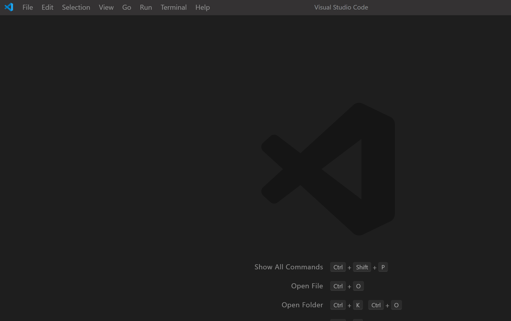

# vscode-go-by-example

VS Code extension to make the awesome [Go By Example](https://gobyexample.com) content available in the editor and offline.

Content from Go By Example is copyright Mark McGranaghan and included under a Creative Commons Attribution 3.0 Unported License (https://creativecommons.org/licenses/by/3.0/).

